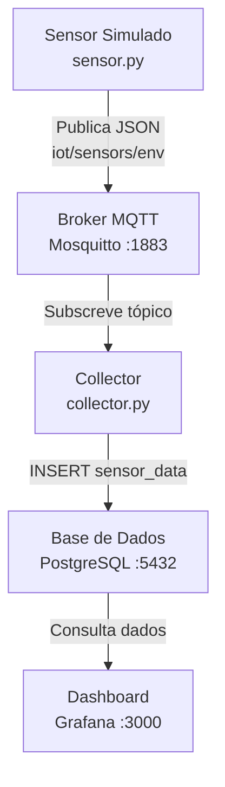

# Projeto 02 - Sistema de Monitorização Ambiental IoT

Este projeto foi desenvolvido no âmbito da unidade curricular de **Laboratórios de Sistemas e Serviços (LSS)**.  
O principal objetivo é implementar uma arquitetura IoT completa que simula sensores ambientais, recolhe dados através de um broker MQTT (Mosquitto), persiste essa informação numa base de dados relacional (PostgreSQL) e disponibiliza dashboards interativos através do Grafana — tudo orquestrado via Docker Compose.

## Arquitetura

### Diagrama do Sistema



### Arquitetura de Repositório

O repositório encontra-se organizado da seguinte forma:

```
Projeto2LSS/
│   README.md                   # Este ficheiro, com as instruções gerais do projeto
│   docker-compose.yml          # Orquestração de todos os serviços Docker
│   .gitignore
│
├── src/
│   ├── Dockerfile              # Imagem Python partilhada pelo sensor e collector
│   ├── requirements.txt        # Dependências Python (paho-mqtt, psycopg2)
│   ├── sensor.py               # Simulador de sensores — publica no tópico MQTT
│   └── collector.py            # Subscriber MQTT — persiste dados na PostgreSQL
│
├── db/
│   └── init.sql                # Script de inicialização da tabela sensor_data
│
└── mosquitto/
    └── mosquitto.conf          # Configuração do broker MQTT
```

## Configuração e Execução

### Pré-requisitos

* **Docker** e **Docker Compose** instalados e em funcionamento.
* Não são necessárias instalações adicionais — todos os serviços correm em contentores.

> **Nota (Windows):** Certifique-se de que o Docker Desktop está iniciado antes de executar os comandos abaixo.

### Execução

#### 1. Iniciar Todos os Serviços

Na raiz do repositório, execute:

```bash
docker-compose up --build
```

Este comando irá:
- Compilar a imagem Python do `sensor` e do `collector`
- Iniciar o broker **Mosquitto** na porta `1883`
- Iniciar a base de dados **PostgreSQL** na porta `5432` e criar automaticamente a tabela `sensor_data`
- Iniciar o **Grafana** na porta `3000`
- Iniciar o **sensor** (publica leituras de temperatura, humidade e qualidade do ar a cada 5 s)
- Iniciar o **collector** (subscreve o tópico MQTT e persiste os dados na base de dados)

#### 2. Aceder ao Grafana

Abra o browser e navegue para:

```
http://localhost:3000
```

| Campo    | Valor   |
| :------- | :------ |
| Utilizador | `admin` |
| Palavra-passe | `admin` |

#### 3. Configurar a Fonte de Dados no Grafana

1. Vá a **Connections → Data Sources → Add data source**.
2. Escolha **PostgreSQL**.
3. Preencha os seguintes detalhes:

| Parâmetro | Valor          |
| :-------- | :------------- |
| Host      | `db:5432`      |
| Database  | `iot_data`     |
| User      | `iot_user`     |
| Password  | `iot_password` |
| SSL Mode  | `disable`      |

4. Clique em **Save & Test**.

#### 4. Criar uma Dashboard

Crie uma nova Dashboard e adicione painéis utilizando a tabela `sensor_data`.  
As colunas disponíveis são:

| Coluna           | Descrição                            |
| :------------  | :----------------------------------- |
| `id`              | Identificador único do registo       |
| `sensor_id`    | Identificador do sensor (1 a 3)      |
| `temperature`  | Temperatura em °C (15.0 – 35.0)      |
| `humidity`     | Humidade relativa em % (30.0 – 80.0) |
| `air_quality`  | Qualidade do ar em AQI (50.0 – 150.0)|
| `timestamp`     | Data e hora do registo (UTC)         |

## Autores

* [**Rui Tavares**](https://github.com/RuiTavaresUA)
* [**João Carlos**](https://github.com/JoaoCarlos1342)

## Licença

Este projeto está licenciado ao abrigo da Licença MIT — consulte o ficheiro [LICENSE](LICENSE) para obter detalhes.

## Bibliografia | Webgrafia

Para este trabalho foram utilizados:
- Os diapositivos do Professor Mário Antunes das aulas sobre Docker, MQTT e bases de dados.
- A documentação oficial do [Eclipse Mosquitto](https://mosquitto.org/documentation/).
- A documentação oficial do [Grafana](https://grafana.com/docs/).
- A documentação oficial do [paho-mqtt].
- O [Mermaid](https://mermaid.js.org/) para a criação de diagramas em Markdown.